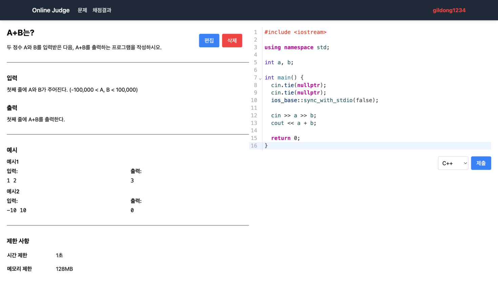
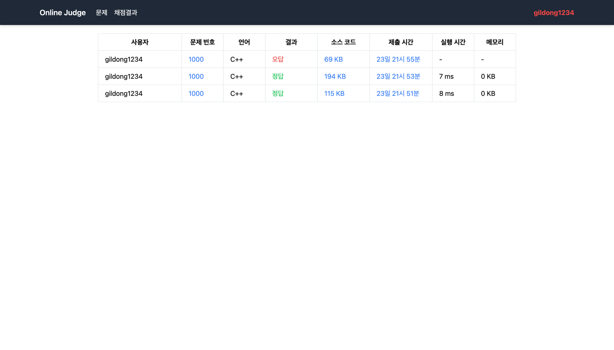

# ALGORRITHM

온라인 알고리즘 문제 풀이 및 채점 서비스

## Tech Stack

### Frontend

### Backend

### Image

## Features

- 독립된 환경에서 알고리즘 문제 채점 (Docker Container)
- 문제 풀이 제출 및 채점

## Screenshots

## Authors

- [@son-daehyeon](https://www.github.com/son-daehyeon)
